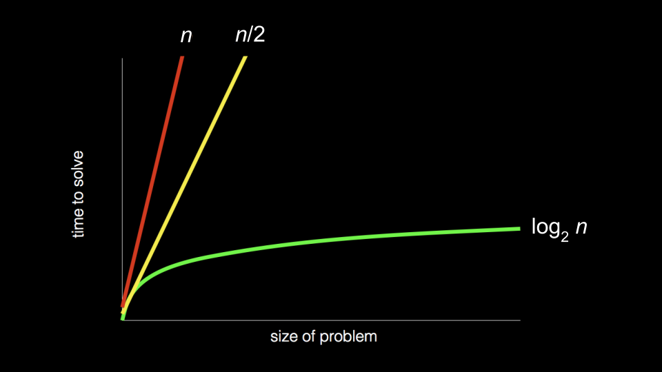

# CS50 Week 0 — Scratch

## Introduction

Computer Science is all about **problem solving**.

```
Input => [Processing] => Output
```

Example:

- Light bulb off → `0`
- Light bulb on → `1`

---

## Number Systems

### Unary (Base-1)

- Counting is done by single marks.
- Very inefficient for large numbers.

### Binary (Base-2)

You can count up to **31** on one hand using binary:

| 16  | 8   | 4   | 2   | 1   |
| --- | --- | --- | --- | --- |
| 0   | 0   | 0   | 0   | 0   |
| 1   | 1   | 1   | 1   | 1   |

`11111` in binary = 31 in decimal.

Positional values in binary:

```
2^4  2^3  2^2  2^1  2^0
```

### Decimal (Base-10)

Positional values in decimal:

```
10^2  10^1  10^0
```

### Bytes and Bits

- 1 byte = 8 bits = `1111 1111` in binary.
- Bits are just **on** or **off** because it’s simpler and more reliable than handling multiple voltage levels.

---

## Binary Representation

Binary can represent:

- Letters
- Numbers
- Emojis
- RGB images
- Videos
- Sound

**Examples:**

- `65` → `A`
- `66` → `B`
- `67` → `C`
- `97` → `a`

**ASCII** — American Standard Code for Information Interchange.

---

## Algorithms

### Definition

An **algorithm** is a precise description of how to do something. It must be:

- Precise
- Correct
- Finite

## 

### Example (Phone Book Search)

**Pseudocode:**

```
1   Pick up phone book
2   Open to middle of phone book
3   Look at page
4   If person is on page
5       Call person
6   Else if person is earlier in book
7       Open to middle of left half of book
8       Go back to line 3
9   Else if person is later in book
10      Open to middle of right half of book
11      Go back to line 3
12  Else
13      Quit
```

Algorithms are used in:

- Artificial Intelligence
- Large Language Models

---

## What's Ahead?

Example in C:

```c
#include <stdio.h>

int main(void) {
    printf("hello, world\n");
}
```

---

## Side Effects in Programming

Example in Scratch:

```
Input: "hello world"
   => [[say block]]
   => Output: "hello world"
```

---

## Scratch Coordinate System

- `(0, 0)` is at the **center** of the stage, not the top-left corner.

---

## My Scratch Game Idea — Problem Set 0

**UI Concept:**

```
Player = P

[Riddle] => Hint

000

[][][][][]
[][][][][]
[][][][][]
[][][][][]
[][][][][P]

[Warmer!]
```

**Description:**

- Player clicks a square.
- First click → square becomes "damaged".
- Second click → square is destroyed.

---
